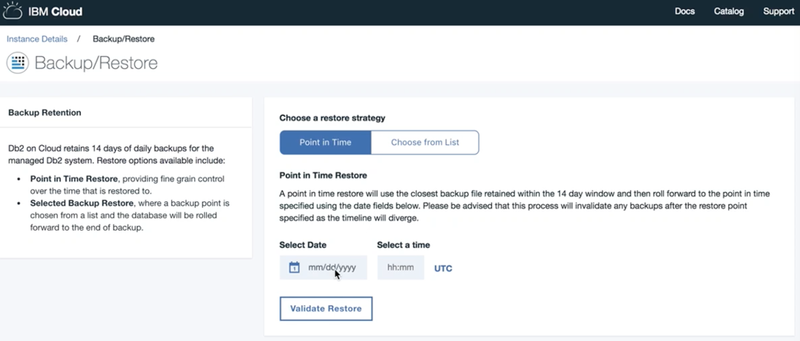

---

copyright:
  years: 2014, 2019
lastupdated: "2019-01-02"

keywords: 

subcollection: Db2onCloud

---

<!-- Attribute definitions --> 
{:external: target="_blank" .external}
{:shortdesc: .shortdesc}
{:codeblock: .codeblock}
{:screen: .screen}
{:tip: .tip}
{:important: .important}
{:note: .note}
{:deprecated: .deprecated}
{:pre: .pre}

# Backup and restore
{: #bnr}

For paid plans, encrypted backups of the database are done daily. A daily backup is kept for each of the last 14 days.
{: shortdesc}

In addition to standard backups, you can use the [Time Travel Query](https://developer.ibm.com/answers/questions/426878/how-do-i-use-time-travel-query-in-db2-or-db2-on-cl.html){:external} to keep historical data for other purposes, such as instantly querying old data or simplified auditing. You can also perform your own exports using IBM Data Studio or any Db2 tool.
 
For information about point-in-time restores, see [Point-in-time restore](#point-in-time).

All paid plans typically make use of IBM Cloud Object Storage (COS) to keep backups offsite in 3 different data centers. However, Sydney and certain smaller data centers might not support offsite replication with IBM COS at this time. Check the [IBM COS documentation](/docs/services/cloud-object-storage/basics?topic=cloud-object-storage-endpoints#endpoints) for your region to determine which regions support offsite replication.

You can also use [IBM Lift CLI](https://www.lift-cli.cloud.ibm.com/){:external} to import data into {{site.data.keyword.Db2_on_Cloud_short}}.

## Point-in-time restore
{: #point-in-time}

{{site.data.keyword.Db2_on_Cloud_short}} has added a point-in-time restore capability. You can restore to an exact point in time from your backups. Today, for most customers, you must request support to activate this feature. See the following rollout schedule.

The following is an availability list of the point-in-time restore feature:
- Dallas data center: Available today on single server systems
- All other cases, including Europe and HA systems in Dallas: Request feature activation from support. Full rollout to all systems will be completed by Feb 28, 2019.
- IBM Cloud Dedicated system: Only available by opening a support ticket.

The following are a selected example of screenshots of the web console UI in which the point-in-time restore operation is initiated and its progress is indicated:

1. Select the **Point in Time** restore strategy and select a point-in-time date to which you want to restore the database. The point-in-time restore process selects the backup closest to your requested point-in-time date out of the pool of retained backups made during the previous 14 days. 

   The point-in-time restore process invalidates any of the previously retained backups with dates after the selected point-in-time date because of a resultant divergence in the timeline.
   {: note}

   {: caption="Figure 1. View of the highlighted selection of the point-in-time restore strategy" caption-side="bottom"}

2. Confirm that you want to continue with your restore selections. After initiating the restore operation, you cannot change the request.  
{: caption="Figure 2. View of the point-in-time restore confirmation dialog" caption-side="bottom"}

3. The restore process is initializing. 
{: caption="Figure 3. View of the point-in-time restore initialization" caption-side="bottom"}

4. Restoring the database to the selected point in time.
{: caption="Figure 4. View of the progress of the point-in-time restore" caption-side="bottom"}

5. A new backup point is being created. The point-in-time restored database is ready to use.
{: caption="Figure 5. View of the creation of a backup point" caption-side="bottom"}

6. The restore operation completed successfully.
{: caption="Figure 6. View of the successful completion of the restoration" caption-side="bottom"}

