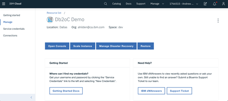

---

copyright:
  years: 2014, 2020
lastupdated: "2020-09-03"

keywords: DR, HADR, disaster recovery, legacy, Flex, Db2 on Cloud, failover

subcollection: Db2onCloud

---

<!-- Attribute definitions --> 
{:external: target="_blank" .external}
{:shortdesc: .shortdesc}
{:codeblock: .codeblock}
{:screen: .screen}
{:tip: .tip}
{:important: .important}
{:note: .note}
{:deprecated: .deprecated}
{:pre: .pre}
{:video: .video}

# Disaster recovery (DR)
{: #dr_gen}

High availability disaster recovery (HADR) provides a high availability solution for both partial and complete site failures. HADR protects against data loss by replicating data changes from a source database, called the primary database, to the target databases, called the standby databases.
{: shortdesc}

## Legacy Flex plans
{: #dr_legacy}

{{site.data.keyword.Db2_on_Cloud_short}} Legacy Flex plans feature disaster recovery (DR) capabilities, where users can add a DR node, which resides in a different region, by using Db2's High Availability Disaster Recovery (HADR) technology. Promoting to the recovery site gives users the ability to recover data affected by unpredictable circumstances. The Recovery site is always in a different region than the Primary site.

In a case of a disaster, the failover to the recovery site will not be initiated by IBM. For the DR failover, you must initiate the takeover from the UI. In case of a failure in the primary site, it is important to remember that you will not have access to the primary system to initiate the takeover. 

Bookmark the **Manage Disaster Recovery** page found under the **Manage** menu item in your {{site.data.keyword.Bluemix_notm}} dashboard.
{: important}

To enable the DR failover, complete the following steps:

1. Select **Manage Disaster Recovery** under the **Manage** menu item in your {{site.data.keyword.Bluemix_notm}} dashboard.
   {: caption="Figure 1. View of the Manage dashboard page" caption-side="bottom"}
1. Click **Access Recovery Site Console**.
   {: caption="Figure 2. View of the Manage Disaster Recovery page" caption-side="bottom"}
1. Log in with your `bluadmin` credentials.
   {: caption="Figure 3. View of the DR login page" caption-side="bottom"}
1. Click **Initiate Takeover on Recovery Site** to initiate the takeover on the recovery site.
   {: caption="Figure 4. View of the DR takeover page" caption-side="bottom"}
1. In the case of the primary site connect status being `Disconnected`, you'll have to navigate to the recovery site URL, which is found in the file that was downloaded by clickng on the **Download Disaster Recovery Details** link on the **Manage Disaster Recovery** page. Log in with your credentials and issue a failover.

## Standard and Enterprise plans
{: #dr_stan_ent}

Coming soon!
{: note}

