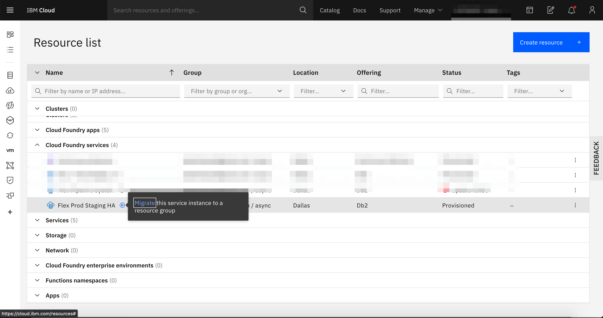

---

copyright:
  years: 2014, 2020
lastupdated: "2020-11-19"

keywords: 

subcollection: Db2onCloud

---

<!-- Attribute definitions --> 
{:external: target="_blank" .external}
{:shortdesc: .shortdesc}
{:codeblock: .codeblock}
{:screen: .screen}
{:tip: .tip}
{:important: .important}
{:note: .note}
{:deprecated: .deprecated}
{:pre: .pre}

# Recovery steps after auto upgrade
{: #recovery}

If you did not start the upgrade process from your legacy plan, you will be automatically upgraded in a rolling fashion starting **November 11, 2020**. The following instructions describe the workflow to recover the upgraded system after the auto-upgrade process was initiated.
{: shortdesc}

These steps can be run on an instance only after the initiation of the auto-upgrade by the {{site.data.keyword.Db2_on_Cloud_short}} team. If your legacy instance is still online and available, then the auto-upgrade was not initiated and you must not run the following recovery procedure steps.
{: important}

## Recovery procedure
{: #rec_steps}

1. [Log in to the {{site.data.keyword.cloud_notm}} account](http://cloud.ibm.com){: external} where the legacy {{site.data.keyword.Db2_on_Cloud_short}} system was provisioned.

   {: caption="Figure 1. Highlight your service instance" caption-side="bottom"}

2. If your legacy plan instance is listed under **Cloud Foundry services**, it must be migrated to a resource group. 

   {: caption="Figure 2. Cloud Foundry instance" caption-side="bottom"}

   - To migrate to a resource group, select the instance and click **Migrate**. After completion of the migration, the Db2 instance is now listed under **Services**.

     {: caption="Figure 3. Migrating Cloud Foundry Instance" caption-side="bottom"}

3. Copy the CRN of your legacy instance now listed under **Services**.

   {: caption="Figure 4. Copy the legacy plan CRN" caption-side="bottom"}

4. Order a Standard or Enterprise instance, specifying the legacy plan CRN in the **Recovery** field to start the recovery process. When you are recovering an auto-upgraded instance, do **not** use the Upgrade field.

   {: caption="Figure 5. Initiate the recovery" caption-side="bottom"}

5. The new {{site.data.keyword.Db2_on_Cloud_short}} service instance is visible under **Services**. However, the new instance is not ready for use until the owner of the account is notified by email that it is available for use.

6. The time to recovery depends on the size of the database, but in most cases it is completed in less than 24 hours.

