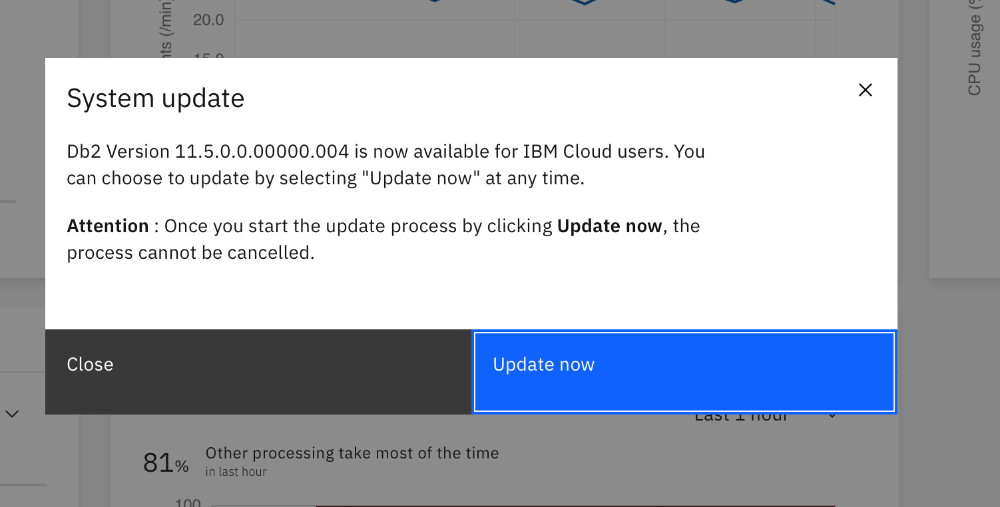
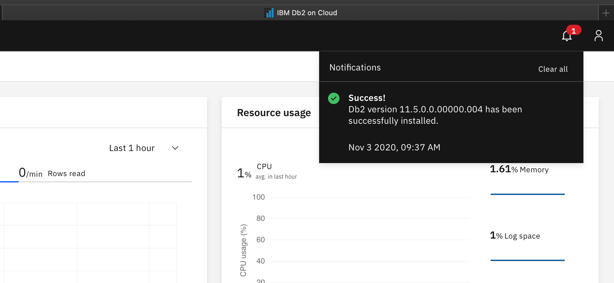

---

copyright:
  years: 2014, 2020
lastupdated: "2020-11-12"

keywords: self-serve, system update, plan

subcollection: Db2onCloud

---

<!-- Attribute definitions --> 
{:external: target="_blank" .external}
{:shortdesc: .shortdesc}
{:codeblock: .codeblock}
{:screen: .screen}
{:tip: .tip}
{:important: .important}
{:note: .note}
{:deprecated: .deprecated}
{:pre: .pre}
{:video: .video}

# Self-serve system updates
{: #self_serve_update}

## Enterprise and Standard plans
{: #ssu_plans}

Enterprise and Standard plans give you the ability to apply system updates to your instances at a time of your choosing. 

The update process can be disruptive, especially for single node instances, so it's advisable to run the update during a maintenance window.
{: important}

### Notification
{: #ssu_notif}

You are notified of an instance system update through the **Notifications** icon in the upper right of the console. New notifications are indicated by a number in a red ellipse.

{: caption="Figure 1. Self-serve update notification" caption-side="bottom"}

Clicking **View details** brings up the **System update** information window that displays the new Db2 version of {{site.data.keyword.Db2_on_Cloud_short}}.  

{: caption="Figure 2. System update information" caption-side="bottom"}

### Updating
{: #ssu_updating}

You can click **Update now** to initiate the update when you're ready. 

With the update initiated, a progress window is presented under the **Notifications** icon.

{: caption="Figure 3. System Update Progress" caption-side="bottom"}

### Update completion
{: #ssu_fin}

Upon completion of a successful update, a **Success!** window appears.

{: caption="Figure 4. Successful Update" caption-side="bottom"}

